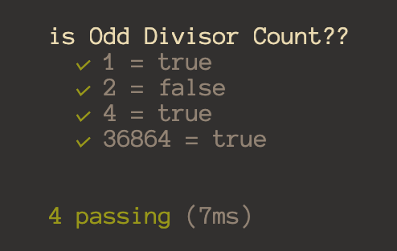
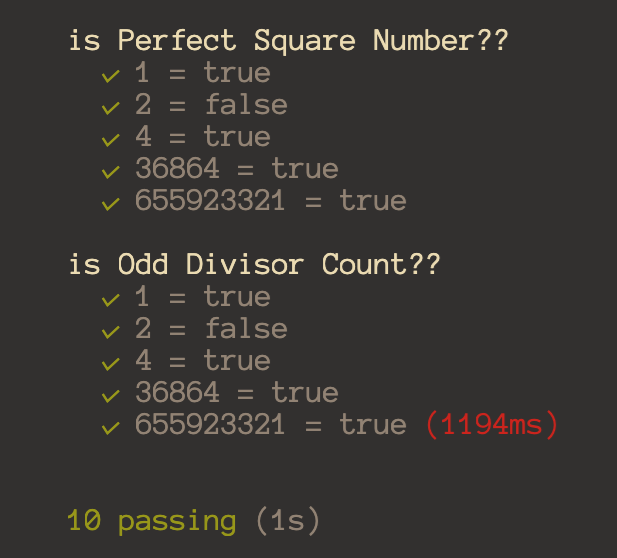
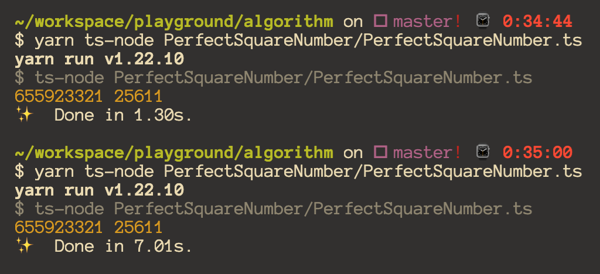

# 완전 제곱수 구하기 (1~N까지 숫자중에서)

오랜만에 devlog에 글을 남기게 되었습니당. 브런치도 velog도 github도 고민해봤는데 그래도 여기다가 차근 차근 올린 뒤에 여력이 될 때 블로그를 전반적으로 수정해볼 예정쓰....
근데 velog에도 적긴 해야할 거 같아요..

우연치 않게 완전 제곱수를 구해야 하는 문제를 풀게 됬습니당. (물론 다짜고짜 완전제곱수를 구하라는 건 아니었고 문제 풀이를 하다 보니 완전제곱수의 개수를 구하는 문제...)

그래서 처음엔 단순히 약수의 개수를 구해서 개수가 홀수인 수를 찾으려 했습니다.

```ts
const isOddDivisorCount = (num: number): boolean => {
  let count: number = 0
  for (let i = 1; i <= num; i++) {
    if (num % i === 0) count++
  }
  return count % 2 === 0 ? false : true
}
```

위 함수를 실행 시켜보면 올바른 결과값을 추출해 내긴 했는데...



하지만 이 함수의 실행 시간이 오류에서 걸렸습니다 ㅠㅠ 당연히 1~N까지의 개수를 찾아야 하다보니 N까지 저 함수를 돌리면 N\*N이므로 O(n^2)의 최악의 탐색 방법..

그렇다면 홀수 개수인 걸 구지 for문을 다 돌지 않고도 찾아내야 하는 방법이 필요했고 9의 약수의 개수까지 계산했을 때 쯤 x = n^2 형태의 숫자는 홀수개수란 것을 알게 되었습니다.

약수의 개수를 구하면 보통 d = n \* x/n (n은 1씩 증가, x/n은 정수) 이런 형태?? 가 될텐데 `(오랜만에 써보는 식이라서.. 알파벳이 생각이 안나네융..)` 즉 1 x n, 2 x n/2 이렇게 약수가 쌍으로 생기다가 d = x/d일 경우엔 약수가 n 1개만 생기게 됩니다!!! 그러므로 약수의 개수가 홀수이면 완전제곱수!!

그래서 다음 풀이 함수를 만들어봤습니당

```ts
export const isPerfectSquareNumber = (num: number): boolean =>
  Number.isInteger(Math.sqrt(num))
```

딱봐도 for 없어지고 훨씬 더 간편해보이는 함수!! 다른 사례들을 보니까 sqrt % 1의 결과를 0과 비교 연산하시더라구요! 그게 더 코스트가 적게드는 방법일까요..? mocha로 돌릴때는 똑같은 것 같던데..

아무튼 실행 결과를 보면



처음 풀었던 함수는 숫자가 커지면서 실행시간에 큰 이슈가 생기게 되었습니다. 하지만 두번째 풀이는 저 5개의 숫자를 돌려도 5ms로 측정되었습니다.

음..하지만 제가 마지막으로 제출한 이 함수도 해당 테스트 조건에 통과하지는 못했어요..아무리 이렇게 해도 N의 크기가 무수히 크다면 O(n)으로는 이슈가 발생하게 되는 거 같아요!

> 그렇다면 O(logN)의 형태를 생각해봐야했는데..
> 이건 시간내에 생각하진 못했고 오늘 아침 샤워하다가 생각난 풀이 방법입니다!

간단하게 설명을 하자면 제곱수는 1,4,9,16,25 의 형태로 증가하게 됩니다. 숫자를 잘보시면 처음엔 3, 그다음엔 5, 그다음엔 7..

### 즉 An = A(n-1) + @ (@는 n1 = 3, +2씩 증가하는 등차수열)

이라는게 떠올랐고, for문의 증감식에 이것을 적용하면, N까지 모든 숫자를 셀 필요도 없으며 N이 커질 수록 건너뛰는 숫자도 많아지게 됩니다 즉 O(logN)의 형태로 나올 수 있다는 생각이 들게 되었꼬 그게 사실 이 포스트를 작성하게 된 이유입니당

```ts
const isPerfectSquare = (num: number): number => {
  let count = 0
  let i = 1
  let d = 1
  while (i <= num) {
    count++
    i = i + 3 + (d - 1)
    d = d + 2
  }

  return count
}
```

이 코드와 아까 구한 완전제곱수 확인함수를 for loop 돌려본다면



상당히 유의미한 시간 단축을 확인 할 수 있었습니다.

하지만 어.. 숫자가 어디서 많이 본 숫자에요.. 25611.. 25611\*25611 = 655923321입니다..
확인해보면.. 1까지는 1개 4까지는 2개 3까지는 3개 4까지는 4개.. 사실.. N = n\*n이라면

> N까지의 완전제곱수는 n\*n (n=1,d=1) 의 형태로 가기 때문에 n개만큼의 완전제곱수를 가지는 거였습니다..

# 최종답

```ts
export const getCountPerfectSquare = (num: number): number =>
  Math.floor(Math.sqrt(num))
```

## 느낀점

사실은.. 답을 올려두고 싶은 마음보다는 내가 어떠한 과정에서 더 쉽게 접근할 수 있는 걸 빙빙 돌아갔는지, 그 과정 속에서 느낀 점은 무엇인지를 적어두고 싶었습니당..

처음은 너무 단순하게 접근했고, 그 단순한 접근 법에서 어떻게 하면 효율적으로 계산량을 줄일지 고민하다 보니 너무 for문을 제거하는 거에만 집중했었던 것 같아요..

좀 더 여유를 갖고 결과값을 봤다던지, 완전제곱수에 대해 파악을 했었다면, 아마도 두번째 함수가 나왔을 때 풀이가 끝났을 것 같아요..

그래도 참 단순한 문제였지만 최악의 방법부터 점점 차선책으로 퀄리티를 올리고, 결국엔 최선의 방법을 찾아낸 경우였어서 이렇게 정리 해봅니당

물론 보시자마자 풀으신 분들도 계시겠지만.. 아무튼....
