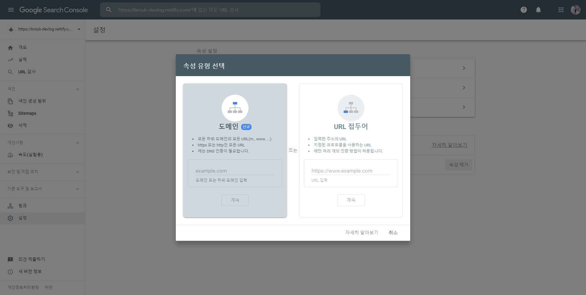
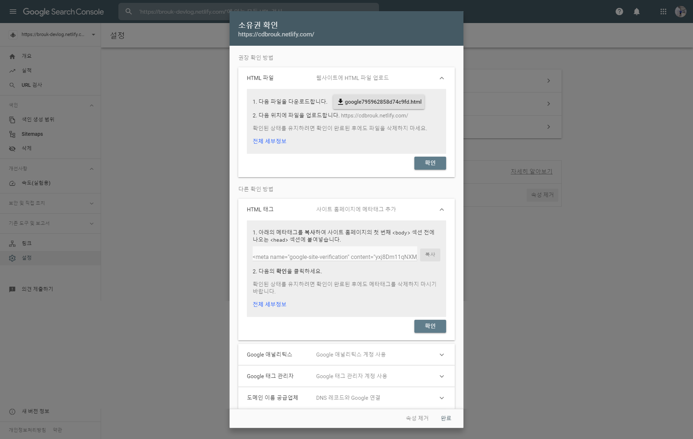
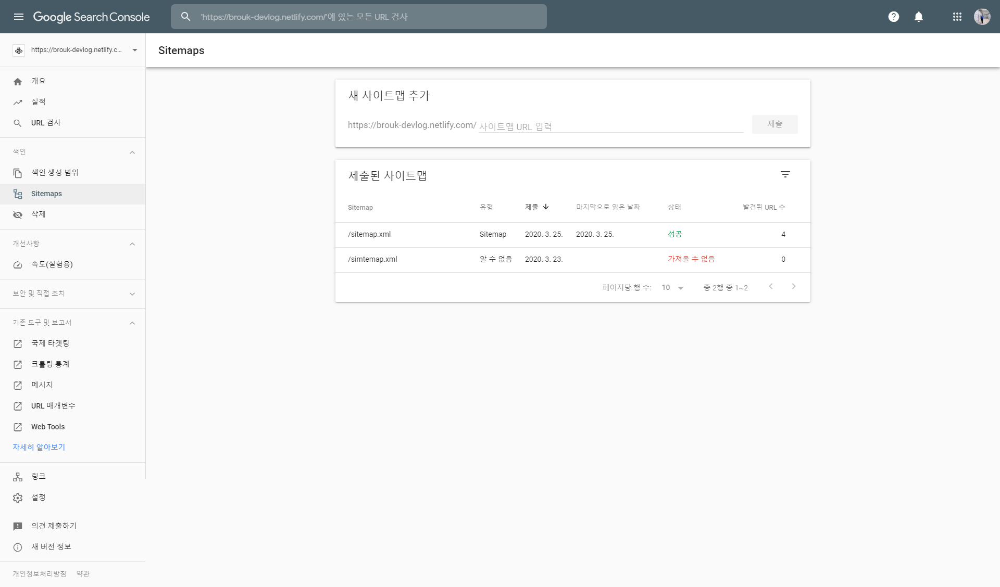
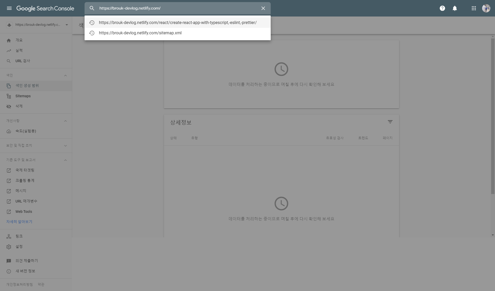
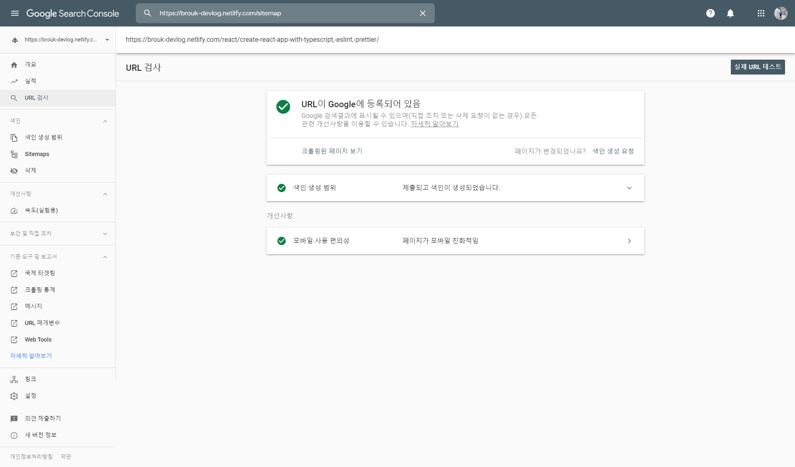

## Reference

##### [delivan.dev](https://delivan.dev/web/gatsby-blog-seo-1/)

> 이 포스팅은 delivan님의 글을 읽고 제 개인적인 학습 정리 용도로 적었기 때문에 원본 글을 꼭 참고 하길 바랍니다.

---

## Google Search Console

> 구글 서치 콘솔 가이드를 꼭 보시길 바랍니다

---

Google 등록을 위해 Google Search Console에 들어가시면 아래와 같은 화면을 보실 수 있는데



`URL 접두어 항목`을 선택하시고 본인 사이트의 URL을 입력하시면 됩니다.

잠시 후에



위와 같은 화면이 나오시면 다른 확인 방법에서 HTML 태그를 선택 해당 `meta tag`를 복사하셔서 프로젝트에 넣어주시면 되겠습니다.

## react-helmet

---

[react-helmet](https://github.com/nfl/react-helmet)은 react component들이 document head를 바꿀 수 있도록 도와주는 라이브러리 입니다.

위에서 받아온 구글 소유권 확인 태그를 웹페이지에 등록하기 위해 `helmet`을 통하여 meta 태그를 입히도록 합니다

```sh
yarn add react-helmet
```

라이브러리를 설치하셨으면 App의 시작 index부분에 가셔서 `helmet`을 달아주시면 되겠습니다.

`gatsby-starter-bee`의 경우는 기본적으로 `react-helmet`을 통해 meta태그를 작성하고 있기에 header에 가시면 코드를 확인 하실 수 있습니다.

##### src/head/index.jsx

```js{3}

<Helmet
  ...
  meta={[
    ...
    {
      name: 'google-site-verification',
      content: '해당 값'
    }
  ]}
  ...
/>
```

그 후에 다시 `Google Search Console`에서 URL을 입력하면 인증된 소유자임을 확인하실 수 있습니다.

## SiteMap

이제 크롤링 봇에게 사이트의 정보를 알려주기 위해 SiteMap이라는 파일을 작성하고 그 파일의 URL을 전달해주어야 합니다.

Gatsby의 경우 간단하게 Sitemap을 만들어 주는 플러그인 `gatsby-plugin-sitemap'`을 이용하면 끝입니다.

```sh
yarn add gatsby-plugin-sitemap
```

설치 후에 config 파일을 수정하시면 되겠습니다.

##### gatsby-config.js

```json
module.exports = {
  ...
  plugins: [
    ...
    `gatsby-plugin-sitemap`,
    ...
  ]
}
```

그 후에 빌드 혹은 배포를 하시고 build 파일 혹은 [본인 URL]/sitemap.xml 로 이동해보시면 sitemap을 확인하실 수 있습니다.

확인이 되시면


`Google Search Console`에서 본인의 사이트맵을 추가하시면 되겠습니다.

저의 경우는 sitemap을 인식하는데 하루 정도 걸렸었습니다..

이후



본인의 URL검사를 하셔서 확인해보신 후



등록이 되어있지 않은 경우에는 색인 생성을 요청하시면 구글 검색 등록이 마무리 되겠습니다.
